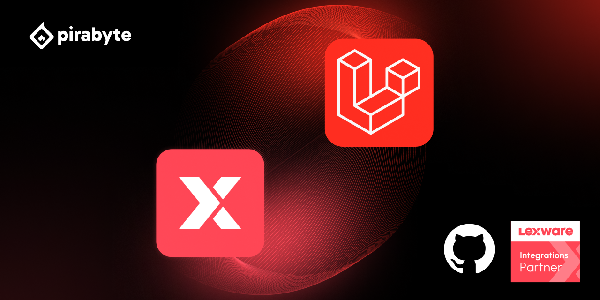

# Laravel Lexware Office

[](https://github.com/pirabyte/laravel-lexware-office/actions/workflows/tests.yml)
[](https://codecov.io/github/pirabyte/laravel-lexware-office)

Laravel-Client für die Lexware Office API mit typisierten Modellen, OAuth2-Unterstützung und lokalem Rate-Limit. Unterstützt PHP ab 8.3 sowie Laravel 11 bis 13.

## Installation

```bash
composer require pirabyte/laravel-lexware-office
```

Trage deinen API-Key in `.env` ein:

```dotenv
LEXWARE_OFFICE_API_KEY=dein-api-key
```

Laravel lädt die Paketkonfiguration automatisch. Wenn du sie anpassen möchtest, veröffentliche sie mit:

```bash
php artisan vendor:publish --provider="Pirabyte\LaravelLexwareOffice\LexwareOfficeServiceProvider" --tag="lexware-office-config"
```

Für die Speicherung von OAuth2-Tokens in der Datenbank kannst du zusätzlich die Migration mit `--tag="lexware-office-migration"` veröffentlichen. `--tag="lexware-office"` veröffentlicht Konfiguration und Migration zusammen.

## Verwendung

Mit dem konfigurierten API-Key nutzt du die Facade:

```php
use Pirabyte\LaravelLexwareOffice\Facades\LexwareOffice;

$contact = LexwareOffice::contacts()->get($contactId);
```

Für einen anderen API-Key erstellst du einen eigenen Client:

```php
use Pirabyte\LaravelLexwareOffice\LexwareOfficeFactory;

$client = LexwareOfficeFactory::withApiKey($apiKey);
$contact = $client->contacts()->get($contactId);
```

Weitere Beispiele: [Kontakte](examples/contacts.md), [OAuth2](examples/oauth2-authentication.md), [Fehlerbehandlung](examples/error-handling.md) und [Partner-Integrationen](examples/partner-integrations.md).

## Implementierungsstand

Diese Ressourcen und Methoden sind derzeit im Paket implementiert:

| Bereich | Zugriff | Methoden |
| --- | --- | --- |
| Kontakte | `contacts()` | `create`, `get`, `update`, `filter`, `all`, `count`, `getAutoPagingIterator` |
| Belege | `vouchers()` | `create`, `createAndAttachFile`, `get`, `update`, `filter`, `all`, `document`, `downloadDocument`, `attachFile` |
| Länder | `countries()` | `all` |
| Finanzkonten | `financialAccounts()` | `create`, `get`, `filter`, `delete` |
| Finanztransaktionen | `financialTransactions()` | `create`, `get`, `update`, `delete`, `latest`, `getVoucherAssignments` |
| Buchungskategorien | `postingCategories()` | `get` |
| Profil | `profile()` | `get` |
| Transaktionszuweisungshinweise | `transactionAssignmentHints()` | `create` |
| Partner-Integrationen | `partnerIntegrations()` | `get`, `update` |

### Besonderheit bei der neuesten Finanztransaktion

`financialTransactions()->latest($financialAccountId)` kann bei einem bestehenden Finanzkonto ohne Transaktionen eine 404-Antwort von Lexware erhalten. Die Methode gibt nur bei einer erfolgreichen, leeren Antwort `null` zurück. Wenn du prüfen musst, ob das Konto existiert, nutze zusätzlich `financialAccounts()->get($financialAccountId)`.

## Rate-Limit

Der bisherige Client prüft aus Kompatibilitätsgründen ein lokales Limit von standardmäßig 50 Anfragen pro Minute. Dieses Limit allein bildet die [aktuellen API-Grenzen von Lexware](https://developers.lexware.io/#api-rate-limits) nicht ab. Du kannst es weiterhin in `config/lexware-office.php` über `max_requests_per_minute` oder am Client ändern:

```php
$client = app('lexware-office');
$client->setRateLimit(10);
```

Für ein Token-Bucket-Limit kannst du einen `TokenBucketRateLimiter` verwenden. Das Beispiel zeigt zwei getrennte Grenzen für eine Verbindung und einen API-Client. Prüfe die aktuell für deinen Zugang geltenden Werte und ob Lexware die Grenzen pro Endpunkt oder über alle Endpunkte hinweg anwendet:

```php
use Pirabyte\LaravelLexwareOffice\RateLimiting\RateLimitBucket;
use Pirabyte\LaravelLexwareOffice\RateLimiting\TokenBucketRateLimiter;

$limiter = new TokenBucketRateLimiter(
    new RateLimitBucket('connection', $connectionId, 2, 5, perEndpoint: true),
    new RateLimitBucket('client', $apiClientId, 5, 5, perEndpoint: true),
);

$client->setRequestRateLimiter($limiter);
```

Für einen API-Schlüssel mit einer Grenze über alle Endpunkte hinweg genügt ein Bucket:

```php
$client->setRequestRateLimiter(new TokenBucketRateLimiter(
    new RateLimitBucket('api-key', $apiKey, 2, 2),
));
```

Der Client reserviert vor jedem HTTP-Versuch Kapazität in allen konfigurierten Buckets und folgt bei aktivem Limiter keinen HTTP-Weiterleitungen automatisch. Der neue Limiter ersetzt für diesen Client das bisherige Minutenlimit. `perEndpoint` ist standardmäßig `false`. Mehrere Worker müssen denselben zentralen Laravel-Cache mit Unterstützung für `Cache::lock()` verwenden, zum Beispiel Redis. Auch direkte HTTP-Aufrufe können mit `$limiter->reserve('POST', 'vouchers')` dieselben Buckets nutzen.

Bei ausgeschöpfter Kapazität wirft der Client eine `LexwareOfficeApiException` mit Status 429 und einem positiven `getRetryAfter()`-Wert. Der Aufrufer entscheidet, wann er erneut versucht. Das bisherige `waitForRateLimitCapacity()` bleibt für das Minutenlimit verfügbar; mit dem Token-Bucket-Limiter erfolgt die Reservierung stattdessen direkt vor dem Request. Die OAuth-Autorisierungsserver-Grenzen sind davon unabhängig.

## Im Einsatz bei

[Envoix](https://envoix.de/) nutzt dieses Paket für seine Lexware Office Anbindung. Die Anwendung bereitet Stripe-Zahlungen, Gebühren und Belege für Lexware Office vor. [So funktioniert die Stripe-Integration](https://envoix.de/stripe-lexware).

## Lizenz

[MIT](LICENSE)
